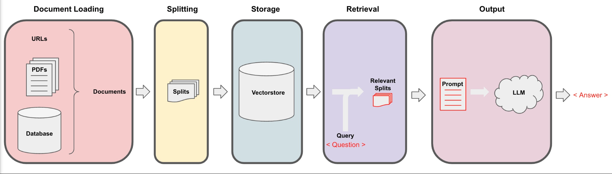

# Chat With Your Data

Requirements

```python
!pip install langchain openai python-dotenv -q

```

## Estructura 

- API keys y Variables de entorno 
- Document Loading
- Document Splitting
- Vectorstores and Embedding (Storage)
- Retrieval
- Question Answering
- Chat
- Conclusion


In this tutorial, we will delve into the essential steps for creating a natural language model. We'll begin by understanding the significance of API keys and utilizing environment variables to ensure security and privacy in our applications. Next, we'll dive into document loading, mastering the handling of various file types and data sources. Following that, we'll tackle document splitting for efficient processing. We'll then proceed to create vector stores and embeddings, crucial for representing the semantic meaning of words. Afterward, we'll explore information retrieval techniques and question-answering capabilities, culminating in the implementation of a chat system based on our model. 

Finally, we'll draw conclusions on the challenges and possibilities within this fascinating field of natural language processing.


## Api Key y Environment VAriables

Crear la API de OPENAI, https://platform.openai.com/account/api-keys

Guardar esa api

Para cargar esa API existen varias maneras, una es utilizar archivos de entorno lo cuales "deben" ser privados, es decir que deben incluirse en el `.gitignore` si se esta trabajando en un entorno de trabajo, (actualmente github detecta si se subio alguna llave a la plataforma, soltara una alerta e inhabilitara la apikey teniendo que crear otra). Y colocarlo manualmente .

### `Dotenv`

Para este metodo se puede crear un archivo `.env` en el entorno de trabajo y enumerar las variables de la siguiente manera `variable = "value_variable"`


```.env
NAME_OF_VARIABLE="sk-xxxxxxxxxxxxxxxx"
```

Y para utilizar se usa `python-dotenv`, el cual mediante las funciones `load_dotenv` y `find_dotenv`, cargara las variables dentro del archivo `.env`. 

```python
# `!pip install python-dotenv`
from dotenv import load_dotenv, find_dotenv
load_dotenv(find_dotenv())

secret_variable = os.environ['NAME_OF_VARIABLE']
```

### Colab 

Para colab podemos introducir un formulario con getpass, el cual ocultara la apikey cuando es introducida, la desventaja a comparacion del anterior metodo es que siempre tendremos que pegar la api key cada vez que se ejecute el archivo.

```python
# !pip install openai
import getpass, openai
api_key = getpass.getpass(prompt="OPENAI - KEY: ")
openai.apikey = api_key
```


## 